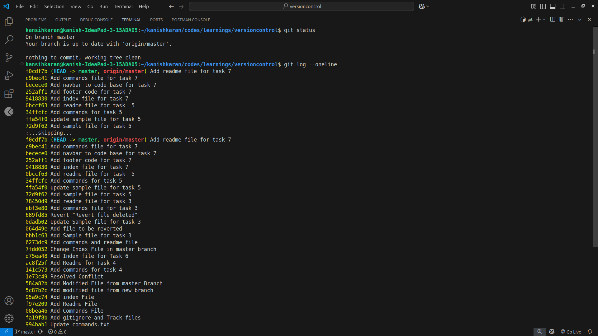
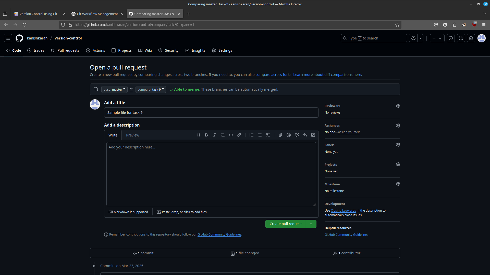
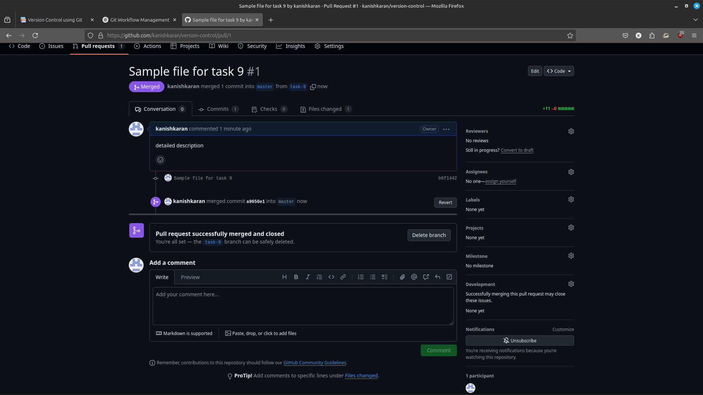

# **Git Workflow: Creating a Branch, Making a Pull Request, Reviewing & Merging**

This guide explains how to create a local repository, create a new branch, make a pull request, review code, merge changes, and finally pull the updates to the local repository.

---

## **1. Initialize a Local Repository and Create a Branch**
1. Clone an existing repository or initialize a new one:
   ```sh
   git clone <repository_url>
   cd <repository_name>
   ```
2. Create a new branch:
   ```sh
   git checkout -b feature-branch
   ```


---

## **2. Make Changes and Commit**
1. Modify or add new files in the repository.
2. Stage the changes:
   ```sh
   git add .
   ```
3. Commit the changes:
   ```sh
   git commit -m "Added new feature"
   ```



---

## **3. Push Changes and Create a Pull Request**
1. Push the branch to the remote repository:
   ```sh
   git push origin feature-branch
   ```
2. Open GitHub/GitLab/Bitbucket and navigate to your repository.
3. Click on **"New Pull Request"**.
4. Select `feature-branch` as the source and `main` as the target.
5. Click **"Create Pull Request"** and add a description.



---

## **4. Review the Code and Approve the PR**
1. The team reviews the changes in the pull request.
2. Add comments or request changes if needed.
3. Once approved, click **"Merge Pull Request"**.


---



---
## **5. Merge the PR and Pull the Changes Locally**
1. After merging, switch back to `main`:
   ```sh
   git checkout main
   ```
2. Pull the latest changes:
   ```sh
   git pull origin main
   ```


---

## **Conclusion**
This guide covered the complete Git workflow:
- Creating a local repository and branch.
- Making changes and committing them.
- Creating a pull request.
- Reviewing and merging the changes.
- Pulling the updates back to the local repository.

This ensures smooth collaboration and version control in your project.